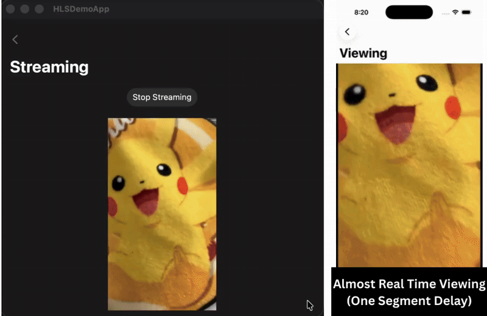

# HTTP Live Streaming App

An simple app for live streaming and live viewing.

Specifically, this repository includes 
- A SwiftUI App for live HLS streaming and viewing
    - Capture the video and audio stream
    - Segment it into HLS format, ie: create the mp4 and m4s files as well as the playlist (m3u8), in real time
    - Send the data to the server for distribution, ie: for other people to view it, in real time.
    - A simple live-viewing view with AVKit: VideoPlayer
- A distribution server for serving the playlist over HTTP
- A WebSocket server for uploading segmented files and the playlist.

### To set up the server
- `npm install` to install the dependencies
- `npm run dev:distributer` to start the distribution server listening on port `8000`.
- `npm run dev:websocket` to start the upload WebSocket server listening on port `8001`.

### To test out the App
- If you are not running the App on the Mac, you will need to change the IP address to the public IP Address of the Mac, or where ever you are running the server on
- Run the app on multiple devices
    - streaming side: a real device because camera is needed. 
    - viewing side(s): simulators will work

For more details, please refer to my article: [SwiftUI: An HTTP Live Streaming App!](https://medium.com/@itsuki.enjoy/swiftui-an-http-live-streaming-app-20dfe555c716)

